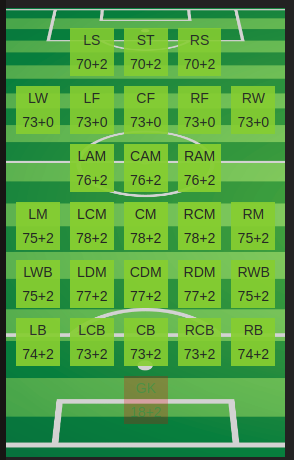

```{r setup, include=FALSE}
knitr::opts_chunk$set(echo = TRUE)
```

## Uvod
U ovim vježbama obrađujemo općenite koncepte postavljanja i testiranja statističkih hipoteza te računanja p-vrijednosti na primjeru konkretnih statističkih testova za metričke podatke (kao što su t-test, $\chi^2$-test i F-test) te statističkih testova za kategorijske podatke (kao što su $\chi^2$-test i Fisher-Irwinov egzaktni test).

## Case study: *FIFA 19*

[Kaggle.com](https://www.kaggle.com/ "Kaggle.com") je web stranica namjenjena natjecanju pojedinaca nad raznim zadatcima istraživačke naravi kao što su zadatci strojnoga učenja, zadatci statističke analize i slično. Osim toga, Kaggle pruža istraživačima na raspolaganje niz skupova podataka i njihovih analiza, tečajeva te dio svojih računalnih moći.

Jedan takav dataset je i [FIFA dataset](https://www.kaggle.com/stefanoleone992/fifa-20-complete-player-dataset?select=players_20.csv "FIFA data") koji se sastoji od statistika igrača koji su sudjelovali u nogometnoj igrici FIFA od 2015. do 2020. godine. Iz opisa vidimo da su originalni podatci preuzeti sa [sofifa](https://sofifa.com/) web stranice sa koje možemo isčitati opis svakog podatka.
U ovim vježbama ćemo analizirati FIFA 2019 skup podataka te ćemo se dodatno poslužiti podatcima FIFA 2020 kako bi usporedili napredak igrače kroz sezonu.

Kao što smo već naglasili, prije svakog korištenja podataka, potrebno je znati kontekst podataka. Koristit ćemo se alatima deskriptivne analize kako bi se upoznali sa našim skupom podataka i pravilno ih interpretirali.

# Deskriptivna analiza

Učitajmo potrebne pakete.
```{r echo=T, error=FALSE, warning=FALSE, message=FALSE}
library(dplyr)
```


Učitajmo podatke.

```{r}
fifa19 = read.csv("players_19.csv")
dim(fifa19)
```

Podatci se sastoje od 17770 igrača i 104 njihovih opisa (varijabli).

Koji su nam to opisi igrača?
```{r}
names(fifa19)
```

Igrači su opisani raznim općenitim varijablama (kao što su ime, godine, za koji klub igraju, itd.) te "nogometnim" varijablama (kao što su kvantizirane karakteristike napada, obrane, itd.).

```{r}
View(fifa19)
```


Vidimo da nam nisu svi podatci jednako koristni. Na primjer, varijabla "player_url" je web url igrača na sofifa stranicama odakle je preuzet skup podataka. Sa takvim podatkom ne možemo raditi nikakve statističke zaključke. Dodatno, što više varijabli imamo, to je više naš skup podataka nepregledan. Stoga ih je često poželjno izbaciti iz samog dataseta.

```{r}
fifa19 = select(fifa19, -c("player_url","long_name","real_face","player_tags","loaned_from","player_traits"))
dim(fifa19)
```

Preostalo nam je 98 varijabli koje opisuju nogometne igrače.

Kako se ponašaju te varijable?
```{r}
summary(fifa19)
```


```{r}
sapply(fifa19, class)
```


Skup podataka se pretežito sastoji od "integer" i "factor" podataka.


```{r}
for (col_name in names(fifa19)){
  if (sum(is.na(fifa19[,col_name])) > 0){
    cat('Ukupno nedostajućih vrijednosti za varijablu ',col_name, ': ', sum(is.na(fifa19[,col_name])),'\n')
  }
}

cat('\n Dimenzija podataka: ', dim(fifa19))
```

Smisleno je da varijable koji počinju sa "gk_*" nisu poznate za sve nogometne igrače obzirom da su to varijable koje opisju vratare. Dakle, takve varijable nećemo izbacivati iz skupa podataka. S druge strane, varijabla "nation_jersey_number" ima 93% nedostajećih vrijednosti što znači da nam ne daje puno informacija o igračima. Preostale varijable nemaju puno nedostajećih vrijednosti.

```{r}
fifa19 = select(fifa19, -c("nation_jersey_number"))
dim(fifa19)
```

Promotrimo sada kako izgledaju neke od varijabli nad kojima ćemo kasnije provesti analizu. Promotrimo najprije numeričke varijable.

```{r, fig.width = 14, fig.height=5}
hist(fifa19$weight_kg,main='Weight in kg histogram', xlab='Weight', ylab='Frequency')
hist(fifa19$height_cm,main='Height in cm histogram', xlab='Height', ylab='Frequency')
hist(fifa19$value_eur,main='Value in eur histogram',xlab='Value',ylab='Frequency', breaks=50)
hist(fifa19$wage_eur,main='Wage in eur histogram',xlab='Wage',ylab='Frequency', breaks=50)
```

Pokušajmo log transformacijom približiti podatke normalnoj distribuciji.

```{r, fig.width = 14, fig.height=5}
hist(log(fifa19$value_eur),main='Value in eur histogram',xlab='Value',ylab='Frequency', breaks=50)
hist(log(fifa19$wage_eur),main='Wage in eur histogram',xlab='Wage',ylab='Frequency', breaks=20)
```

Promotrimo sada kategoričke varijable. 

```{r,  fig.width = 14, fig.height=5}
barplot(summary(fifa19$nationality),las=2,cex.names=.5,main='Nationality of players')
print('Igračeva preferirana noga za udarce: ')
table(fifa19$preferred_foot)
barplot(table(fifa19$team_position),las=2,main='Player team position on the field')
```

Primijetimo da varijabla "team_position" sadrži i igrače bez pozicije.

```{r}
table(fifa19$team_position)
```

Konkretnije, njih 223, nemaju poziciju u timu. Moramo pripaziti pri analizi takvih varijabli.


Sada kada smo dobili bolji uvid u naše podatke, možemo si postaviti zanimljiva pitanja te pokušati odgovoriti na njih koristeći razne statističke alate.


## Jesu li hrvatski igrači viši od španjolskih?

```{r}
croatian_players = fifa19[fifa19$nationality == "Croatia",]
spanish_players = fifa19[fifa19$nationality == "Spain",]
```


```{r}
cat('Prosječna visina hrvatskih igrača iznosi ', mean(croatian_players$height_cm),'\n')
cat('Prosječna visina španjolskih igrača iznosi ', mean(spanish_players$height_cm), '\n')
```

```{r}
boxplot(croatian_players$height_cm, spanish_players$height_cm, 
        names = c('Croatian player heights','Spanish player heights'),
        main='Boxplot of croatian and spanish player heights')
```

Postoje indikacije da bi hrvatski igrači trebali biti viši od španjolskih.

Ovakvo ispitivanje možemo provesti t-testom. Moraju li neke pretpostavke biti zadovoljene za naše podatke?

### Testiranje jednakosti srednjih vrijednosti dvije populacije
Neka su $X_1^1, X_1^2, \ldots, X_1^{n_1}$ i $X_2^1, X_2^2, \ldots, X_2^{n_2}$ dva nezavisna slučajna uzorka koji dolaze iz normalnih distribucija s očekivanjima $\mu_1$ i $\mu_2$ te s nepoznatim, ali jednakim varijancama $\sigma$. Zajednička disperzija uzorka se računa kao težinska sredina disperzija $S_{X_1}$ i $S_{X_2}$:

$$S_X^2 = \frac{1}{n_1 + n_2 - 2} [(n_1 - 1) S_{X_1}^2 + (n_2 - 1) S_{X_2}^2].$$

Slučajna varijabla
$$Z = \frac{\bar{X}_1 - \bar{X}_2 - (\mu_1 - \mu_2)}{\sigma \sqrt{\frac{1}{n_1} + \frac{1}{n_2}}}$$

ima jediničnu normalnu distribuciju. Slučajna varijabla
$$W^2 = \frac{(n_1 - 1) S_{X_1}^2 + (n_2 - 1) S_{X_2}^2}{\sigma^2}$$

ima $\chi^2$ razdiobu s $n_1 + n_2 - 2$ stupnja slobode. Zato slučajna varijabla
$$T = \frac{Z \sqrt{n_1 + n_2 - 2}}{W} = \frac{\bar{X}_1 - \bar{X}_2 - (\mu_1 - \mu_2)}{S_X \sqrt{\frac{1}{n_1} + \frac{1}{n_2}}}$$

ima egzaktnu $t$ distribuciju s $n_1 + n_2 - 2$ stupnja slobode.

Ukoliko imamo 2 nezavisno normalo distribuirana uzorka, ali ovoga puta sa  različitim varijancama, tada koristimo testnu statistiku

$$T' = \frac{\bar{X}_1 - \bar{X}_2 - (\mu_1 - \mu_2)}{\sqrt{\frac{s_{X_1}^2}{n_1} + \frac{s_{X_2}^2}{n_2}}}$$

koja ima aproksimativnu t-distribuciju sa stupnjevima slobode 
$$v = \frac{(s_{X_1}^2/n_1+ s_{X_2}^2 / n_2)^2}{(s_{X_1}^2/n_1)^2 / (n_1 - 1) + (s_{X_2}^2/n_2)^2 / (n_2 - 1)}$$
gdje je 
$$s_{X_i}^2 = \frac{1}{n_i - 1} \sum_{j=1}^{n_i} (X_i^j - \bar{X_i})^2 $$
za $i=1,2$.

Hipoteze tada glase:
$$ \begin{aligned}
H_0&: \mu_1 = \mu_2 \\
H_1&: \mu_1 < \mu_2 \quad \text{,} \quad \mu_1 > \mu_2 \quad \text{,} \quad \mu_1 \neq \mu_2
\end{aligned} $$


Test o jednakosti srednjih vrijednosti dvije populacije u R-u je implementiran u funkciji `t.test()`.

Kako bi mogli provesti test, moramo najprije provjeriti pretpostavke normalnosti i nezavisnosti uzorka. Obzirom da razmatramo dva uzoraka iz dvije različite zemlje, možemo pretpostaviti njihovu nezavisnost. Sljedeći korak je provjeriti normalnost podataka koju najčešće provjeravamo: histgoramom, qq-plotom te KS-testom (kojim provjeravamo pripadnost podataka distribuciji).

```{r}
hist(croatian_players$height_cm, 
     breaks=seq(min(croatian_players$height_cm)-1,max(croatian_players$height_cm)+1,3),
     main='Histogram of heights of Croatian players',
     xlab='Height in cm')

hist(spanish_players$height_cm, 
     breaks=seq(min(spanish_players$height_cm)-1.5,max(spanish_players$height_cm)+1.5,3),
     main='Histogram of heights of Spanish players',
     xlab='Height in cm')
```

Histogrami upućuju na normalnost podataka. Normalnost možemo još provjeriti i qqplot-ovima ili testom koji ispituje normalnost.

```{r}
qqnorm(croatian_players$height_cm, pch = 1, frame = FALSE,main='Croatian players')
qqline(croatian_players$height_cm, col = "steelblue", lwd = 2)

qqnorm(spanish_players$height_cm, pch = 1, frame = FALSE,main='Spanish players')
qqline(spanish_players$height_cm, col = "steelblue", lwd = 2)
```

Pod uvjetom da podatci zadovoljavaju sve pretpostavke možemo nastaviti sa t-testom kako bi ispitali da li su hrvatski igrači viši od španjolskih.

Koji test koristiti? Kakve su varijance danih uzoraka?

```{r}
var(croatian_players$height_cm)
var(spanish_players$height_cm)
```

Jesu li varijance značajno različite?

### Test o jednakosti varijanci
Ako imamo dva nezavisna slučajna uzorka $X_1^1, X_1^2, \ldots X_1^{n_1}$ i $X_2^1, X_2^2, \ldots, X_2^{n_2}$ koji dolaze iz normalnih distribucija s varijancama $\sigma_1^2$ i $\sigma_2^2$, tada slučajna varijabla
$$F = \frac{S_{X_1}^2 / \sigma_1^2}{S_{X_2}^2 / \sigma_2^2}$$

ima Fisherovu distribuciju s $(n_1 - 1, n_2 - 1)$ stupnjeva slobode, pri čemu vrijedi:
$$S_{X_1}^2 = \frac{1}{n_1 - 1} \sum_{i = 1}^{n_1} (X_1^i - \bar{X}_1)^2, \quad S_{X_2}^2 = \frac{1}{n_2 - 1} \sum_{i = 1}^{n_2} (X_2^i - \bar{X}_2)^2.$$
Hipoteze testa jednakosti varijanci glase:
$$ \begin{aligned}
H_0&: \sigma_1^2 = \sigma_2^2 \\
H_1&: \sigma_1^2 < \sigma_2^2 \quad \text{,} \quad \sigma_1^2 > \sigma_2^2 \quad \text{,} \quad \sigma_1^2 \neq \sigma_2^2
\end{aligned} $$

U programskom paketu R test o jednakosti varijanci je implementiran u funkciji `var.test()`, koja prima uzorke iz dvije populacije čije varijance uspoređujemo.

Dakle, ispitajmo jednakost varijanci naših danih uzoraka.

```{r}
var.test(croatian_players$height_cm, spanish_players$height_cm)
# F = testna statistika
#  num df = 125, denom df = 1036 - stupnjevi slobode
# p-value = 0.2141, vjerojatnost da dobijemo ovaj uzorak pod uvjetom da je H0 istinit
# p value usporedujemo sa Alpha (0.05)
# je li p < Alpha ?
# p > Alpha => odbacujemo hipotezu

# ## 95 percent confidence interval:
##  3.749018      Inf

# ako uzimamo razlicite uzorke onda ce varijanbca uzorka upadati u interval [3.749018      Inf] u 95% slucajeva

# testna statisika je isto sto i podjela varijanci (?)
```

p-vrijednost od 0.2141 nam govori da nećemo odbaciti hipotezu $H_0$ da su varijance naša dva uzorka jednaka.

Provedimo sada t-test uz pretpostavku jednakosti varijanci.

```{r}
# Bitan je poredak kojim funkciji 't.test()' prosljedjujemo uzorke!
t.test(croatian_players$height_cm, spanish_players$height_cm, alt = "greater", var.equal = TRUE)
```

Zbog jako male p-vrijednost možemo odbaciti $H_0$ hipotezu o jednakosti prosječnih vrijednosti u korist $H_1$, odnosno možemo reći da su hrvatski igrači u prosjeku značajno viši od onih španjolskih.


## Jesu li se španjolski igrači poboljšali u sezoni 2020 (naspram sezone 2019)?

Naš podatkovni skup sadrži opise igrača za sve sezone od 2015. do 2020., što znači da možemo promatrati njihovo ponašanje iz jedne u drugu sezonu.
Primijetimo da `t-test` pretpostavlja nezavisnost uzoraka koje uspoređujemo. Ta pretpostavka je u ovakvim podatcima narušena obzirom da ispitujemo istu vrijablu za isti primjerak za dva različita vremenska trenutka. Dakle, treba nam t-test koji uzima u obzir zavisne (uparene) uzorke.

## Upareni podatci
Ukoliko imamo dva mjerenja neke veličine na istom uzorku i želimo ispitati postoji li značajna razlika između mjerenja, koristimo t-test za uparene podatke, također implementiran u funkciji `t.test()`.

Ako je par $(X_1^i, X_2^i)_{i=1}^n$ uzorak dva mjerenja $n$ primjeraka, slučajna varijabla $D_i$ je tada dana sa:
$$D_i = X_1^i - X_2^i$$.

Obzirom da su dva mjerenja uzeta na istoj populaciji, slučajne varijable $X_1^i$ i $X_2^i$ nisu nezavisne i vrijedi:
$$\sigma_D^2 = Var(D_i) = Var(X_1^i - X_2^i) = \sigma_1^2 + \sigma_2^2 - 2 Cov(X_1^i,X_2^i).$$

Ako stavimo
$$X_1^i = \mu_1 + \eta_1^i , \quad X_2^i = \mu_2 + \eta_2^i,$$
dobivamo 
$$\sigma_D^2 = Var(\eta_1^i) + Var(\eta_2^i) - 2 Cov(\eta_1^i,\eta_2^i).$$
Testna statistika je dana sa:
$$T = \frac{\bar{D} - \mu_D}{S_d / \sqrt{n}}$$
a nulta hipoteza glasi:
$$\begin{aligned}H_0&: \mu_D = d_0 \\
H_1&: \mu_D < d_0 \quad \text{,} \quad \mu_D > d_0 \quad \text{,} \quad \mu_d \neq d0
\end{aligned}$$

note: upareni T test koristimo umjesto T testa ako su nam podaci meduzavisni (npr ako promatramo istog igraca ali iz godine u godinu)

parametar paired = TRUE, 


Učitajmo podatke igrača iz sezone 2020:
```{r}
fifa20 = read.csv("players_20.csv")
dim(fifa20)
```

```{r}
names(fifa20)
```


Spojimo podatke temljem jedinstvenog ključa svakog igrača i provjerimo normalnost podataka:

```{r}
merged_df = merge(fifa19, fifa20, by="sofifa_id", suffixes = c(".19",".20"))
```

```{r}
country = 'Spain'

len = length(merged_df[merged_df$nationality.19 == country,]$overall.19 -  merged_df[merged_df$nationality.19 == country,]$overall.20)

hist(merged_df[merged_df$nationality.19 == country,]$overall.19,
     main=paste('Histogram of players from ',country,' in 2019 (',len,' players)'),
     xlab='Overall score')

hist(merged_df[merged_df$nationality.19 == country,]$overall.20,
     main=paste('Histogram of players from ',country,' in 2020 (',len,' players)'),
     xlab='Overall score')

hist(merged_df[merged_df$nationality.19 == country,]$overall.19 - 
       merged_df[merged_df$nationality.19 == country,]$overall.20,
     main=paste('Histogram of players from ',country,' in 2019 - 2020 (',len,' players)'),
     xlab='Difference of overall score')

qqnorm(merged_df[merged_df$nationality.19 == country,]$overall.19 - merged_df[merged_df$nationality.19 == country,]$overall.20, 
       pch = 1, 
       frame = FALSE, 
       main=paste('QQ-plot for overall score of players from',country,' (',len,'players)'))
qqline(merged_df[merged_df$nationality.19 == country,]$overall.19 - merged_df[merged_df$nationality.19 == country,]$overall.20, 
       col = "steelblue", lwd = 2)
```


Histogram razlika nam sugerira normalnost podataka, dok iz qq-plota vidimo malo odstupanje lijevog repa. 
Pod pretpostavkom da su podatci normalni, koristimo upareni t-test.

```{r}
t.test(merged_df[merged_df$nationality.19 == country,]$overall.19, 
       merged_df[merged_df$nationality.19 == country,]$overall.20, 
       paired = TRUE, 
       alt = "less")
```

Jako mala p-vrijednost nam ukazuje da postoji statistički značajna razlika u "overall score-u" svakog španjolskog igrača, što znači da se njihova kvaliteta promijenila iz sezone 2019 u sezonu 2020.

Napomenimo kako statistička značajnost ne nalaže nužno i praktičnost u pravom svijetu. Vidimo da je razlika u prosječnim "overall" vrijednostima (na skali od 0 do 100) koja opisjue naše igrače porasla za 0.68 iz jedne u drugu sezonu. U slučaju da se ta promjena desila zbog promjene trenera, koji je sada na primjer puno skuplji od prošloga, takva promjena ne bi nužno bila isplativa za klub. Ovakve situacije su česte u slučajevima kada imamo jako velik broj primjera (puno veći nego ovdje), stoga svakako trebamo obratiti pozornost i na smislenost zaključaka nakon testiranja.


## Je li preferirana noga za udarac nezavisna od toga nalazi li pozicija igrača lijevo, desno ili centralno na terenu?

Programski paket R nudi široku podršku za rad s kategorijskim podatcima - od factor tipa podataka, do raznih statističkih alata i testova za analizu kategorijskih varijabli. Kod analize factor tipa podataka, moramo paziti koje su moguće vrijednosti (`levels()`) naše varijable, a koje se stvarno pojavljuju u podatcima.

```{r}
levels(fifa19$preferred_foot)
levels(fifa19$team_position)
```

```{r}
table(fifa19$preferred_foot)
table(fifa19$team_position)
```

U ovom slučaju vidimo da se sve moguće vrijednosti pojavljuju u podatcima.

Sada možemo združiti podatke ovisno da li je njihova pozicija desno, lijevo ili na centru terena. Pozicije igrača imaju raspodjelu kao na slici.

```{r, fig.cap="Klasifikacija pozicije igrača na terenu temeljem sofifa.com stranice odakle su preuzeti podaci", out.width = '100%'}

```

Kopirajmo najprije podatke u novi data.frame kako ne bi promijenili prave vrijednosti.

```{r}
fifa19_copy = data.frame(fifa19)
tracemem(fifa19)==tracemem(fifa19_copy)
untracemem(fifa19_copy)
untracemem(fifa19_copy)
```

Kako bi lakše baratali sa varijablom "team_position", možemo je pretvoriti u "character" tip podatka.

```{r}
fifa19_copy['team_position'] <- sapply(fifa19_copy['team_position'], as.character);
```

Združimo sve razrede centralnih, lijevih i desnih pozicija.

```{r}
# ZDRUŽIMO SVE CENTRALNE POZICIJE
for (column_name in c("ST","CF","CAM","CM","CDM","CB")){
  fifa19_copy$team_position[fifa19_copy$team_position == column_name] = "Central_positions";
}

# ZDRUZIMO SVE LIJEVE POZICIJE
for (column_name in c("LS","LW","LF","LAM","LM","LCM", "LWB", "LDM", "LB", "LCB")){
  fifa19_copy$team_position[fifa19_copy$team_position == column_name] = "Left_positions";
}

# ZDRUZIMO SVE DESNE POZICIJE
for (column_name in c("RS","RF","RW","RAM", "RCM","RM", "RDM", "RWB", "RCB", "RB")){
  fifa19_copy$team_position[fifa19_copy$team_position == column_name] = "Right_positions";
}
```

Kontingencijsku tablicu jedne kategorijske varijable moguće je dobiti pozivanjem funkcije `table()`.

```{r}
tbl = table(fifa19_copy$team_position)
print(tbl)
```

Izbacimo poziciju vratara i zamjenskih igrača i pogledajmo kontingencijsku tablicu varijabli pozicije i preferirane noge za udarce.

```{r}
tbl = table(fifa19_copy[fifa19_copy$team_position == "Central_positions" | fifa19_copy$team_position == "Left_positions" | fifa19_copy$team_position == "Right_positions",]$team_position, 
            fifa19_copy[fifa19_copy$team_position == "Central_positions" | fifa19_copy$team_position == "Left_positions" | fifa19_copy$team_position == "Right_positions",]$preferred_foot)
tbl
```

Kontingencijskoj tablici možemo dodati i sume redaka i stupaca na sljedeći način.

```{r}
added_margins_tbl = addmargins(tbl)
print(added_margins_tbl)
```

Test nezavisnosti $\chi^2$ test u programskom paketu R implementiran je u funkciji `chisq.test()` koja kao ulaz prima kontingencijsku tablicu podataka koje testiramo na nezavisnost. Ispitajmo nezavisnost pozicije igrača na terenu i njegove preferirane noge za udarce.

Pretpostavka testa je da očekivana frekvencija pojedinog razreda mora biti veća ili jednaka 5 (`chisq.test()` pretpostavlja da je ovaj uvjet zadovoljen stoga je prije provođenja testa potrebno to provjeriti).

```{r}
for (col_names in colnames(added_margins_tbl)){
  for (row_names in rownames(added_margins_tbl)){
    if (!(row_names == 'Sum' | col_names == 'Sum') ){
      cat('Očekivane frekvencije za razred ',col_names,'-',row_names,': ',(added_margins_tbl[row_names,'Sum'] * added_margins_tbl['Sum',col_names]) / added_margins_tbl['Sum','Sum'],'\n')
    }
  }
}
```


Sve očekivane frekvencije su veće od 5. Možemo nastaviti sa $\chi^2$ testom.

```{r}
chisq.test(tbl,correct=F)
```


Odbacujemo H0 u korist H1 koja kaže da je pozicija igrača na terenu i njegova preferirana noga za udarce zavisna.


Još neka zanimljiva pitanja koje možete razmotriti su:

1. Je li pozicija igrača na terenu nezavisna od tjelesnog tipa igrača?
2. Jesu li braniči bolji u kontroliranju lopte ("skill_ball_control") od napadača?
3. Imaju li braniči bolje vještine u driblanju ("dribbling") od napadača?


